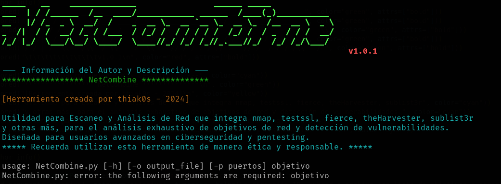

# README - NetCombine v1.0



## Descripción
NetCombine es una herramienta de escaneo y análisis de red diseñada para usuarios avanzados en ciberseguridad y pentesting. Integrando diversas herramientas como nmap, testssl, fierce, theHarvester, sublist3r, entre otras, NetCombine permite realizar un análisis exhaustivo de objetivos de red y la detección de vulnerabilidades.

**Creador:** thiak0s - 2024

## Características Principales
- Escaneo de objetivos individuales o subredes completas.
- Realiza escaneos específicos como ping, whois, nslookup, dig, host, fierce, theHarvester, sublist3r, y testssl.
- Integración de escaneos NSE Nmap con opciones como OS fingerprinting, aggressive scan, service version detection, entre otros.
- Opción para guardar resultados en un archivo externo.
- Soporte para especificar puertos a escanear.

## Requisitos
- Python 3.x
- Módulos requeridos: argparse, subprocess, logging, termcolor, pyfiglet, concurrent.futures, ipaddress, platform.

## Instalación de Dependencias
Se proporciona un script de instalación (`install_dependencies.sh`) que facilita la configuración del entorno necesario para ejecutar NetCombine. Asegúrate de tener los privilegios necesarios para instalar paquetes en el sistema antes de ejecutar el script.
Este script realiza la instalación de las siguientes dependencias:
- Paquetes Python: termcolor, pyfiglet, platform.
- Herramientas de escaneo: nmap, fierce, theharvester, sublist3r, testssl.sh, nikto.

Además, actualiza el PATH para incluir los scripts de nmap y la carpeta `/usr/local/bin`. Después de ejecutar el script, las herramientas estarán instaladas y configuradas correctamente.

## Uso
```bash
python netcombine.py <objetivo> [-o <output_file>] [-p <puertos>]
```

### Parámetros
- `<objetivo>`: La dirección IP, subred o archivo con lista de objetivos a escanear.
- `-o, --output <output_file>`: Guardar resultados en un archivo externo.
- `-p, --puertos <puertos>`: Puertos a escanear, separados por coma.

### Ejemplos de Uso
1. Escanear una dirección IP:
   ```bash
   python netcombine.py 192.168.1.1 -o output.txt -p 80,443
   ```

2. Escanear una subred:
   ```bash
   python netcombine.py 192.168.1.0/24 -o output.txt -p 80,443
   ```

3. Escanear desde un archivo:
   ```bash
   python netcombine.py targets.txt -o output.txt -p 80,443
   ```

4. Obtener información de ayuda:
   ```bash
   python netcombine.py --help
   ```

### Notas Importantes

- Recuerda utilizar esta herramienta de manera ética y responsable.

### Licencia

Este proyecto se distribuye bajo la licencia [MIT](LICENSE).

---

¡Espero que encuentres útil NetCombine para tus trabajos de escaneo y análisis de red all-in-one! Si tienes preguntas, problemas o sugerencias, no dudes en [contactarme](https://github.com/thiak0s). ¡Gracias por utilizar NetCombine!
